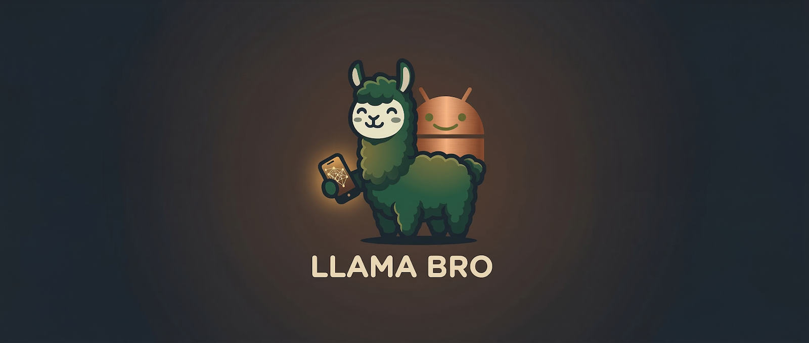

# Llama Bro SDK Android

> **Run a full AI model in your pocket. On your terms. No servers. No subscriptions. No data leaving your phone.**



[](https://github.com/whyisitworking/llama-bro/actions/workflows/build.yml)
[](https://github.com/whyisitworking/llama-bro/releases/latest/download/LlamaBro-Demo.apk)
[](https://jitpack.io/#whyisitworking/llama-bro)
[](https://android-arsenal.com/api?level=24)
[](LICENSE)
[](https://developer.android.com/ndk/guides/abis)

Llama Bro is a thin, performant Android SDK that runs quantized LLM models directly on-device via [llama.cpp](https://github.com/ggml-org/llama.cpp). Built with Kotlin coroutines and structured concurrency for modern Android development. Whether you're a privacy-focused builder, an offline-first enthusiast, or just curious about what's possible on a phone, Llama Bro makes AI inference as simple as a single Gradle dependency.

### 🚀 Try the Demo App
Want to see the inference speed and reasoning capabilities in action before writing any code? 

[](https://github.com/whyisitworking/llama-bro/releases/latest/download/LlamaBro-Demo.apk)

---

## Why Llama Bro?

**🔒 True Privacy**
No API keys. No telemetry. No models calling home. Your data never leaves the device.

**💰 Zero Token Cost**
Run models as much as you want—no usage limits, no payment APIs, no surprise bills.

**⚡ Fast Local Inference**
Tap the device's SIMD capabilities (NEON, dotprod, i8mm) for real-time responses. ~20 tokens/second on modern flagships.

**📱 Built for Android**
Kotlin-native coroutine API. No threading headaches. No callback hell. Just `suspend fun` and `Flow`.

**🎯 Production-Ready**
Thread-safe sessions. Memory-safe lifecycle management. Structured error handling. Works with Hilt. Works with architecture patterns you already use.

**🧠 Reasoning Models Included**
Built-in thinking-block parsing for DeepSeek-R1, QwQ, and other reasoning models. See the model's thought process.

---

## Quick Start (3 minutes)

### 1. Add the dependency

```kotlin
// settings.gradle.kts
dependencyResolutionManagement {
    repositories {
        google()
        mavenCentral()
        maven { url = uri("https://jitpack.io") }
    }
}

// Check the JitPack/Github badge above for the latest version number. build.gradle.kts (app)
dependencies {
    implementation("com.github.whyisitworking:llama-bro:<LATEST_VERSION>")
}
```

### 2. Download a model

Grab a GGUF-quantised model from [Hugging Face](https://huggingface.co/models?library=gguf). **Recommended for first-time users:**

- **Gemma 3n (2B, Q4_K_M, ~3 GB)** — Best balance of speed and quality
  - [unsloth/gemma-3n-E2B-it-GGUF](https://huggingface.co/unsloth/gemma-3n-E2B-it-GGUF)
- **Llama 3.2 (1B, Q4_K_M, ~600 MB)** — Ultra-lightweight; good for testing
  - [bartowski/Llama-3.2-1B-Instruct-GGUF](https://huggingface.co/bartowski/Llama-3.2-1B-Instruct-GGUF)
- **DeepSeek-R1 (7B, Q4_K_M, ~5 GB)** — For reasoning/thinking blocks
  - [bartowski/DeepSeek-R1-Distill-Qwen-7B-GGUF](https://huggingface.co/bartowski/DeepSeek-R1-Distill-Qwen-7B-GGUF)

**Quantisation guide:** `Q4_K_M` is the gold standard on mobile (best quality-to-speed tradeoff). For maximum speed on low-RAM devices, try `Q3_K_M` or `Q2_K`. For quality-first, try `Q5_K_M` (slower, larger).

### 3. Load and chat

```kotlin
import com.suhel.llamabro.sdk.*
import com.suhel.llamabro.sdk.model.flatMapResource
import com.suhel.llamabro.sdk.model.filterSuccess
import com.suhel.llamabro.sdk.model.onEachLoading

// Declarative flow composition (auto-cleanup on cancellation)
lifecycleScope.launch {
    LlamaEngine.createFlow(
        ModelConfig(
            modelPath = "/path/to/model.gguf",
            promptFormat = PromptFormats.ChatML,
        )
    )
    .onEachLoading { progress -> 
        updateProgressBar(progress ?: 0f) 
    }
    .flatMapResource { engine ->
        engine.createSessionFlow(
            SessionConfig(
                contextSize = 4096,
                overflowStrategy = OverflowStrategy.RollingWindow(500),
                inferenceConfig = InferenceConfig(
                    temperature = 0.7,
                    repeatPenalty = 1.15,
                )
            )
        )
    }
    .flatMapResource { session ->
        session.createChatSessionFlow("You are a helpful assistant.")
    }
    .filterSuccess()  // Extract chat session, drop Loading/Failure
    .flatMapLatest { chatSession ->
        chatSession.completion("Explain coroutines in one paragraph.")
    }
    .collect { completion ->
        updateTextView(completion.contentText.orEmpty())
      
        if (completion.isComplete) {
            logPerformance("${completion.tokensPerSecond} tokens/sec")
        }
    }
}
```

That's it. No callbacks. No manual resource management. Flow handles cleanup when cancelled.

---

## Use Cases

**Privacy-First Chat**
Build conversational features for health, finance, or sensitive domains without worrying about data residency.

**Offline Assistants**
Code editor plugins, keyboard assistants, or writing tools that work on a flight.

**Real-Time Reasoning**
Run models that can think step-by-step (DeepSeek-R1, QwQ) and extract their reasoning for debugging or transparency.

**Reducing Latency**
No round-trip to a remote server. Get responses in milliseconds, not seconds.

---

## API Overview

Llama Bro's API is tiered by abstraction level. Use what you need:

### `LlamaEngine` — Model loading and session factory

Responsibility: Load the GGUF file, manage model weights, create sessions.

```kotlin
// Recommended: Flow-based (auto-cleanup on cancellation)
LlamaEngine.createFlow(modelConfig)
    .collect { resourceState -> /* handle loading/success/error */ }

// Manual: Explicit lifecycle control
val engine = LlamaEngine.create(modelConfig) { progress ->
    updateProgressBar(progress)
    true  // Return false to cancel load
}

val session = engine.createSession(sessionConfig)
// ... use session ...
engine.close()  // Release model memory
```

**When to use:** Always start here. Keep one engine per model.

### `LlamaSession` — Token-level inference

Responsibility: Manage KV cache, encode/decode tokens, sample.

```kotlin
// Full control: manually encode, then generate tokens one by one
suspend fun manualInference(session: LlamaSession) {
    session.setSystemPrompt("You are helpful.")
    session.prompt("What's 2+2?")

    val output = StringBuilder()
    while (true) {
        val token = session.generate() ?: break  // null = EOS
        output.append(token)
    }
    return output.toString()
}
```

**When to use:** Building custom sampling loops, token-level debugging, or advanced inference control. Most use cases don't need this.

### `LlamaChatSession` — High-level conversation API

Responsibility: Format messages, handle stop tokens, extract thinking blocks, compute metrics.

```kotlin
// Simple: One-liner for chat completions
chat.completion("Explain coroutines.").collect { completion ->
    println(completion.contentText)
}
```

**When to use:** 95% of use cases. Handles formatting, thinking block extraction, metrics.

---

**All operations are `suspend` functions or `Flow`—no callbacks, no blocking threads.**

---

## Configuration

### Model Config

| Option         | Default                   | Purpose                                                            |
|----------------|---------------------------|--------------------------------------------------------------------|
| `modelPath`    | required                  | Absolute path to `.gguf` model file                                |
| `promptFormat` | required                  | Chat template (`Llama3`, `Gemma3`, `ChatML`, `Mistral`, or custom) |
| `threads`      | `availableProcessors / 2` | Inference thread count; tune for performance cores                 |
| `useMmap`      | `true`                    | Memory-map model file (faster loading, lower peak RAM)             |
| `useMlock`     | `false`                   | Lock model in RAM (prevents swapping; use on capable devices only) |

**Example:**
```kotlin
ModelConfig(
    modelPath = "/data/models/gemma-3n.gguf",
    promptFormat = PromptFormats.Gemma3,
    threads = 8,  // Match your device's performance core count
    useMmap = true,
    useMlock = false
)
```

### Session Config

| Option             | Default              | Purpose                                         |
|--------------------|----------------------|-------------------------------------------------|
| `contextSize`      | `4096`               | KV cache size in tokens (max prompt + response) |
| `overflowStrategy` | `RollingWindow(500)` | Behavior when cache is exhausted                |
| `inferenceConfig`  | (see below)          | Sampling parameters                             |
| `decodeConfig`     | (see below)          | Batch decoding tuning                           |
| `seed`             | `-1` (random)        | Set to a fixed value for reproducibility        |

### Inference Config (Sampling)

Control token generation quality and diversity:

| Option            | Default | Range     | Purpose                                                                 |
|-------------------|---------|-----------|-------------------------------------------------------------------------|
| `temperature`     | `0.8`   | `0.0–2.0` | Sampling creativity; `0.0` = greedy (always pick best), `1.0` = neutral |
| `repeatPenalty`   | `1.1`   | `1.0–2.0` | Penalize recent tokens to avoid loops                                   |
| `presencePenalty` | `0.0`   | `0.0–2.0` | Penalize all previously seen tokens                                     |
| `minP`            | `0.1`   | `0.0–1.0` | Min-probability threshold; `null` to disable                            |
| `topP`            | `null`  | `0.0–1.0` | Nucleus sampling; `null` = disabled                                     |
| `topK`            | `null`  | `1–∞`     | Top-K sampling; `null` = disabled                                       |

**Example:**
```kotlin
InferenceConfig(
    temperature = 0.7,        // Slightly conservative
    repeatPenalty = 1.15,     // Discourage repetition
    minP = 0.05,              // Filter low-probability tokens
    topP = 0.9                // Nucleus sampling for diversity
)
```

### Decode Config (Performance Tuning)

| Option                | Default | Purpose                                       |
|-----------------------|---------|-----------------------------------------------|
| `batchSize`           | `2048`  | Max tokens processed per decode step          |
| `microBatchSize`      | `512`   | Internal chunking for memory efficiency       |
| `systemPromptReserve` | `100`   | Tokens reserved for system prompt in rollover |

Increase `batchSize` to `4096` for faster prefill on long system prompts; decrease if memory-constrained.

### Overflow Strategies

When the KV cache reaches `contextSize`, select one:

- **`Halt`** — Throw `LlamaError.ContextOverflow`. Use for strict determinism.
- **`ClearHistory`** — Discard all prior messages, reload system prompt, continue.
- **`RollingWindow(dropTokens)`** — Evict oldest `dropTokens` tokens, keep chatting (recommended).

**Example:**
```kotlin
SessionConfig(
    contextSize = 4096,
    overflowStrategy = OverflowStrategy.RollingWindow(dropTokens = 500)
)
```

---

## Supported Models

Llama Bro works with any GGUF model that runs in `llama.cpp`. Built-in templates cover the major families:

| Template  | Format                                   | Recommended Models             | Size Range                 |
|-----------|------------------------------------------|--------------------------------|----------------------------|
| `Gemma3`  | `<start_of_turn>` / `<end_of_turn>`      | Gemma 3, Gemma 3n              | 2B–27B (Q4_K_M: 1.5–16 GB) |
| `Llama3`  | `<\|start_header_id\|>` / `<\|eot_id\|>` | Llama 3 / 3.1 / 3.2 / 3.3      | 8B–70B (Q4_K_M: 5–40 GB)   |
| `ChatML`  | `<\|im_start\|>` / `<\|im_end\|>`        | Qwen 2.5, Yi, InternLM, Hermes | 1B–72B (varies)            |
| `Mistral` | `[INST]` / `[/INST]`                     | Mistral 7B, Mixtral 8x7B       | 7B–46B (Q4_K_M: 4.5–30 GB) |

**Finding models:** Browse [Hugging Face](https://huggingface.co/models?library=gguf) for GGUF quantisations. **Starting recommendation:** Gemma 3n (2B, ~3 GB) or Llama 3.2 (1B, ~600 MB) for testing.

**Custom templates:** For models not listed above, define your own:

```kotlin
val custom = PromptFormat(
    systemPrefix = "<<SYS>>\n",
    systemSuffix = "\n<</SYS>>\n\n",
    userPrefix = "[INST] ",
    userSuffix = " [/INST]",
    assistantPrefix = "",
    assistantSuffix = "</s>"
)

LlamaEngine.create(
    ModelConfig(modelPath = "/path/to/model.gguf", promptFormat = custom)
)
```

**How to find the right template:** Check the model's Hugging Face card or README for the "chat template" field. It usually tells you the exact markers and order.

---

## ResourceState Flow Extensions

Llama Bro provides declarative flow operators to compose resource lifecycles cleanly:

```kotlin
// Extract success value or null
val engine: LlamaEngine? = resourceState.getOrNull()

// Transform success value, preserving Loading/Failure
val mapped: ResourceState<String> = resourceState.map { it.toString() }

// Transform success values in a flow
engineFlow.mapSuccess { engine -> MyWrapper(engine) }

// Chain sequential resource flows (Engine → Session → Chat)
engineFlow
    .flatMapResource { engine -> engine.createSessionFlow(config) }
    .flatMapResource { session -> session.createChatSessionFlow("System") }
    .filterSuccess()  // Emit only loaded chat sessions
    .collect { chat -> /* use chat */ }

// React to success without transforming the value
engineFlow.onEachSuccess { engine ->
    updateProgressBar(1.0f)  // Engine loaded
}

// Extract only successful values from a flow
chatFlow.filterSuccess()  // Flow<LlamaChatSession> instead of Flow<ResourceState<...>>

// Exhaustive pattern matching
resourceState.fold(
    onLoading = { progress -> showLoadingUI(progress ?: 0f) },
    onSuccess = { value -> showSuccessUI(value) },
    onFailure = { error -> showErrorUI(error) }
)

// Extract value or supply a default on error/loading
val engine = resourceState.getOrElse { error -> fallbackEngine }
```

These operators enable **declarative, type-safe composition** without nested `when` blocks.

---

## Thinking Blocks & Reasoning Models

Reasoning models like DeepSeek-R1 and QwQ expose internal thoughts via `<think>...</think>` tags. Llama Bro extracts them automatically:

```kotlin
chat.completion("Hard problem").collect { completion ->
    // View the model's reasoning
    completion.thinkingText?.let { thinking ->
        println("Model reasoning:\n$thinking")
    }

    // View the final answer
    println("Final answer:\n${completion.contentText}")

    // Check performance
    if (completion.isComplete) {
        println("Generated at ${completion.tokensPerSecond} tokens/sec")
    }
}
```

Perfect for explainability, debugging, or understanding complex model behavior. The `Completion` data class provides:

- **`thinkingText`** — Content inside `<think>...</think>` blocks (reasoning models only)
- **`contentText`** — Visible response text (everything outside thinking blocks)
- **`tokensPerSecond`** — Streaming performance metric
- **`isComplete`** — True when generation ends (EOS reached)

---

## Architecture

Llama Bro is a clean, layered stack:

```
┌────────────────────────────────┐
│ LlamaChatSession               │  High-level chat API
│ (formatting, stop detection)   │
├────────────────────────────────┤
│ LlamaSession                   │  Token-level control
│ (mutex-serialized, abort-safe) │
├────────────────────────────────┤
│ LlamaEngine                    │  Model loader
│ (ResourceState<T> lifecycle)   │
├────────────────────────────────┤
│ JNI Bridge                     │  Kotlin ↔ C++
│ (error codes, callbacks)       │
├────────────────────────────────┤
│ C++ Engine (llama.cpp)         │  GGML, SIMD backends
│ (NEON, dotprod, i8mm, SVE)     │
└────────────────────────────────┘
```

All native pointers are wrapped in `AutoCloseable` interfaces. Cancellation is safe. Leaks are prevented.

---

## Performance Tips

**Benchmark:** ~20 tokens/second on OnePlus 13 (Gemma 3n 2B, Q4_K_M).

**Tune for your device:**

1. Use `Q4_K_M` quantisation—best quality-to-speed tradeoff on mobile.
2. Set `threads` to match your device's performance core count.
3. Keep `useMmap = true` (default) to avoid loading the full model into RAM.
4. Increase `decodeConfig.batchSize` to `4096` for faster prefill on long prompts.
5. Models > 4 GB may need `useMlock = false` to avoid out-of-memory on mid-range phones.

---

## Completion Streaming

Each emission from `chat.completion(message)` is a `Completion` snapshot:

```kotlin
data class Completion(
    val thinkingText: String?,       // Internal reasoning (reasoning models only)
    val contentText: String?,        // Visible response text
    val tokensPerSecond: Float?,     // Performance metric (rolling average)
    val isComplete: Boolean          // True when EOS reached (generation done)
)
```

The flow emits cumulative snapshots—each one contains all tokens generated so far, not just new tokens. Use `isComplete` to detect end-of-generation:

```kotlin
chat.completion("Hello").collect { completion ->
    if (!completion.isComplete) {
        // Still generating
        updateUI(completion.contentText)  // Partial response
    } else {
        // Generation finished
        saveToDatabase(completion)
        logMetrics("Final speed: ${completion.tokensPerSecond} t/s")
    }
}
```

---

## Conversation History

Restore prior chats from a database:

```kotlin
val history = listOf(
    Message.User("What's Kotlin?"),
    Message.Assistant("Kotlin is a JVM language..."),
    Message.User("And coroutines?")
)

chat.loadHistory(history)
chat.completion("Explain together").collect { /* ... */ }
```

The session's KV cache is pre-populated with the history, so the next response is contextual and faster.

---

## Error Handling

All errors cross the JNI boundary as typed exceptions:

```kotlin
sealed class LlamaError : Exception {
    class ModelNotFound(val path: String)
    class ModelLoadFailed(val path: String, cause: Throwable?)
    class BackendLoadFailed(val backendName: String)
    class ContextInitFailed(cause: Throwable?)
    class ContextOverflow
    class DecodeFailed(val code: Int)
    class NativeException(val nativeMessage: String, cause: Throwable?)
}
```

Handle them with idiomatic Kotlin:

```kotlin
LlamaEngine.createFlow(modelConfig)
    .catch { e ->
        when (e) {
            is LlamaError.ModelNotFound -> showFilePicker()
            is LlamaError.ContextOverflow -> handleFullContext()
            else -> throw e
        }
    }
    .collect { /* ... */ }
```

---

## Examples

### Example 1: ViewModel with Declarative Flow Composition

```kotlin
@HiltViewModel
class ChatViewModel @Inject constructor(
    modelRepository: ModelRepository  // Injected model source
) : ViewModel() {

    private val modelPath = "/data/models/gemma-3n.gguf" // Inject through adb/Android file explorer for testing

    // Single declarative flow chain for the entire lifecycle
    private val chatSessionFlow = LlamaEngine.createFlow(
        ModelConfig(modelPath, PromptFormats.Gemma3)
    )
    .onEachSuccess { _loadingProgress.value = 1.0f }  // Model ready
    .flatMapResource { engine ->
        engine.createChatSessionFlow(
            systemPrompt = "You are a helpful assistant.",
            sessionConfig = SessionConfig(
                contextSize = 4096,
                overflowStrategy = OverflowStrategy.RollingWindow(500)
            )
        )
    }
    .filterSuccess()  // Only emit loaded chat sessions
    .stateIn(viewModelScope, SharingStarted.Lazily, null)

    fun sendMessage(userMessage: String): Flow<String> =
        chatSessionFlow
            .filterNotNull()
            .flatMapLatest { chat ->
                chat.completion(userMessage)
                    .map { it.contentText.orEmpty() }
            }
}
```

No manual `onCleared()` cleanup needed—the flow scoping handles lifecycle automatically.

### Example 2: Real-Time Streaming to UI

```kotlin
@HiltViewModel
class ResponseViewModel @Inject constructor() : ViewModel() {
    private val _uiState = MutableStateFlow<ResponseUiState>(ResponseUiState.Idle)
    val uiState = _uiState.asStateFlow()

    fun generateResponse(message: String) {
        viewModelScope.launch {
            chatSession.completion(message)
                .onStart { _uiState.value = ResponseUiState.Loading }
                .collect { completion ->
                    _uiState.value = ResponseUiState.Streaming(
                        text = completion.contentText.orEmpty(),
                        tokensPerSecond = completion.tokensPerSecond,
                        thinking = completion.thinkingText,
                        isComplete = completion.isComplete
                    )
                }
        }
    }
}

// In Compose or XML Fragment
uiState.collect { state ->
    when (state) {
        is ResponseUiState.Streaming -> {
            Text(state.text)  // Updates in real-time
            if (state.thinking != null) {
                CollapsibleThinkingBlock(state.thinking)
            }
            if (state.isComplete) {
                PerformanceLabel("${state.tokensPerSecond} tokens/sec")
            }
        }
        ResponseUiState.Loading -> LoadingSpinner()
        ResponseUiState.Idle -> {}
    }
}
```

### Example 3: Extracting Reasoning from DeepSeek-R1

```kotlin
// Use with reasoning models (DeepSeek-R1, QwQ)
val engine = LlamaEngine.create(
    ModelConfig(
        modelPath = "/data/models/deepseek-r1-7b-q4.gguf",
        promptFormat = PromptFormats.ChatML
    )
)

val chat = engine.createSession(SessionConfig()).createChatSession("You are a math tutor.")

chat.completion("Solve: 2^10 + 3^4 - 5^2").collect { completion ->
    if (!completion.isComplete) return@collect  // Wait for final token

    val reasoning = completion.thinkingText ?: ""
    val answer = completion.contentText ?: ""

    println("=== Model's Reasoning ===")
    println(reasoning.take(500) + "...")  // First 500 chars

    println("\n=== Final Answer ===")
    println(answer)

    println("\nPerformance: ${completion.tokensPerSecond} tokens/sec")
}
```

The thinking block is stripped from the visible response automatically—you get both simultaneously.

### Example 4: Custom Prompt Format for Unsupported Models

```kotlin
// For models not in the built-in templates, define your own format
val customFormat = PromptFormat(
    systemPrefix = "<<SYS>>\n",
    systemSuffix = "\n<</SYS>>\n\n",
    userPrefix = "[INST] ",
    userSuffix = " [/INST]\n",
    assistantPrefix = "",
    assistantSuffix = "</s>\n"
)

val modelConfig = ModelConfig(
    modelPath = "/data/models/my-custom-model.gguf",
    promptFormat = customFormat
)

// Use it like any built-in template
val engine = LlamaEngine.create(modelConfig)
val session = engine.createSession(SessionConfig())
val chat = session.createChatSession("You are helpful.")

// Test it with a known good prompt to verify format correctness
chat.completion("Test message").collect { completion ->
    if (completion.contentText == null || completion.contentText.isEmpty()) {
        println("⚠️ Format may be incorrect; model produced no output")
    } else {
        println("✓ Format working: ${completion.contentText}")
    }
}
```

**Tip:** If responses are garbled or empty, double-check that the prefixes/suffixes match the model's training format exactly. Check the model's repository or card for the correct template.

---

## Building from Source

Clone with the llama.cpp submodule:

```bash
git clone --recursive https://github.com/whyisitworking/llama-bro.git
cd llama-bro
```

Build the SDK:

```bash
./gradlew :sdk:assembleRelease
```

Run tests:

```bash
./gradlew :sdk:test
```

### Build Requirements

| Tool        | Version       |
|-------------|---------------|
| JDK         | 17+           |
| Android SDK | API 36        |
| NDK         | 29.0.14206865 |
| CMake       | 3.22.1+       |

NDK and CMake are installed automatically via the Android SDK manager.

---

## Native Dependencies

The SDK embeds `llama.cpp` as a vendored Git submodule. The CMake build compiles it directly into the `llama_bro` shared library. Key flags:

- **`GGML_OPENCL = OFF`** — No GPU drivers; buggy, prevents UI stalls.
- **`GGML_OPENMP = ON`** — Multi-threaded decode.
- **`GGML_CPU_ALL_VARIANTS = ON`** — All CPU backends; best one selected at runtime.

**Supported ABI:** `arm64-v8a` only.

---

## Limitations & Roadmap

### Current Limitations

- **arm64-v8a only.** No x86_64 emulator support yet.
- **No GPU acceleration.** OpenCL is intentionally disabled, as it causes stalls.
- **Models must be local.** The library doesn't download; you manage model acquisition.
- **No multimodal.** Vision/audio models are not yet supported.
- **Memory constraints.** Full model must fit in RAM; typically limits practical use to 7B Q4 or smaller.

### Roadmap

- [ ] Streaming grammar / JSON-mode
- [ ] Function calling / tool use
- [ ] GGUF metadata reading
- [ ] LoRA adapter support

---

## ProGuard / R8

Consumer ProGuard rules are built-in. The AAR automatically preserves:

- JNI-accessible classes
- Native method signatures
- Fields read reflectively by JNI
- Callbacks invoked from native code

No additional configuration required in your app.

---

## Best Practices

**Keep one engine per model.** Creating multiple engines for the same model wastes memory. Reuse the engine to create many sessions.

**Use flow-based APIs for lifecycle safety.** `LlamaEngine.createFlow()` and `createSessionFlow()` automatically clean up resources on cancellation. Manual `.create()` requires explicit `.close()`.

**Set `threads` to match performance cores.** Use `Runtime.availableProcessors() / 2` as a starting point, then benchmark. Too many threads causes contention; too few leaves cores idle.

**Use `useMmap = true` by default.** Memory-mapping reduces peak RAM and doesn't hurt performance. Disable only if you have specific memory constraints.

**Test your prompt format.** If responses are empty or gibberish, your `PromptFormat` is wrong. Try the model's README or a format from a similar model.

**Handle `ContextOverflow` gracefully.** Use `OverflowStrategy.RollingWindow` for long conversations, or implement a "new conversation" flow when `LlamaError.ContextOverflow` is thrown.

**Cache thinking blocks.** If using reasoning models, save `completion.thinkingText` separately from `contentText` for debugging or audit trails.

---

## Troubleshooting

| Symptom                                    | Cause                                        | Fix                                                                                               |
|--------------------------------------------|----------------------------------------------|---------------------------------------------------------------------------------------------------|
| Model loads but generation is **slow**     | Too few threads; wrong quantisation          | Increase `threads` to match core count; use Q4_K_M                                                |
| **Out of memory (OOM)** on load            | Model too large; `useMlock = true`           | Use smaller model/quantisation; disable `useMlock`                                                |
| **Blank or gibberish** responses           | `PromptFormat` mismatch                      | Check model card for correct template; try built-in formats                                       |
| **Crash on load**                          | File path wrong or file missing              | Verify path exists; check file permissions                                                        |
| **Very slow prefill** on long prompts      | Batch size too small                         | Increase `decodeConfig.batchSize` to `4096`                                                       |
| **Reasoning models** producing no thinking | Thinking not enabled in model config         | Ensure model is trained with thinking blocks (DeepSeek-R1, QwQ); check `<think>` tags in response |
| **Flow never completes**                   | Resource leak or cancellation not propagated | Use `.takeUntil()` to cancel flows; ensure lifecycle scope is cancellable                         |

---

## Contributing

Contributions are welcome. Before opening a PR:

1. Open an issue to discuss non-trivial changes.
2. Run the full test suite: `./gradlew :sdk:test`
3. Build the release AAR: `./gradlew :sdk:assembleRelease`
4. Follow the Kotlin official style guide.
5. Keep native code minimal and well-commented.

---

## License

```
Copyright 2024 whyisitworking

Licensed under the Apache License, Version 2.0 (the "License");
you may not use this file except in compliance with the License.
You may obtain a copy of the License at

    http://www.apache.org/licenses/LICENSE-2.0

Unless required by applicable law or agreed to in writing, software
distributed under the License is distributed on an "AS IS" BASIS,
WITHOUT WARRANTIES OR CONDITIONS OF ANY KIND, either express or implied.
See the License for the specific language governing permissions and
limitations under the License.
```

The embedded `llama.cpp` library is distributed under the [MIT License](https://github.com/ggml-org/llama.cpp/blob/master/LICENSE).

---

**What's next?**
Start with the [Quick Start](#quick-start). Download Gemma 3n. Build something.
